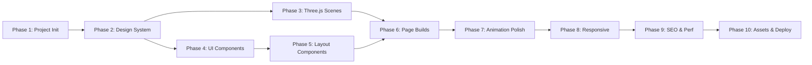

# VayuX Systems — Production-Grade Website Rebuild

Complete rebuild of the VayuX Guardian Systems digital presence from 6 Figma-exported design pages into a production-grade Next.js application with professional Three.js animations, ultra-smooth page transitions, and full mobile/desktop responsiveness.

## Design Analysis Summary

From the Figma exports, the website has **6 distinct pages** with the **"Aetheric Sentinel"** design system:

| Page | Key Sections |
|------|-------------|
| **Home** | Hero (shimmer headline), Trust badges, Vision glass card, Lab vs Vendor, Bento service grid (SOC/VAPT/GRC/DFIR/Training), Core Capabilities deep-dive, FAQ, Floating CTA |
| **About Us** | Hero, Core Principles (4-card bento), Architects of Protection (3 team profiles), Leadership Philosophy + quote, Transparency FAQ |
| **Solutions** | Hero (gradient text), 4 detailed service cards (SOC/VAPT/GRC/DFIR) with tech specs & feedback loops, Bespoke Architecture full-width card, 4 Methodology breakdowns, Solution Q&A |
| **Insights** | Hero with animated orbital decoration, Featured Articles bento (1 large + 2 small), Technical Knowledge Base (4 cards), Research FAQ |
| **Contact** | Hero, Secure Discovery Form + Active Nodes sidebar, 4-step Onboarding Process, Global Node Infrastructure map, Service Engagement FAQ |
| **Legal** | Hero, Sticky TOC sidebar, Terms & Conditions, Privacy Policy, Footer |

**Brand Identity:** Metallic silver eagle with cyan circuit-board traces — "Angel Protector" aesthetic. Luminous, airy, ultra-luxurious glassmorphism. NOT dark/aggressive cybersecurity tropes.

---

## User Review Required

> [!IMPORTANT]
> **Fresh Next.js Project vs. Rebuild in Existing Vite Project:** The existing `vayux-v1` is a Vite + React SPA. The Figma designs represent a significantly different architecture (multi-page with routing, SSR-ready, SEO-optimized). I recommend creating a **new Next.js 15 project** inside the workspace (`vayux-v1` stays as backup). This gives us App Router, file-based routing, server components, metadata API, and proper SEO out of the box.

> [!WARNING]  
> **Three.js Animation Scope:** Professional 3D animations at "million-dollar company" level require significant custom shader work. I'll implement: (1) an interactive 3D eagle logo with metallic PBR materials that responds to mouse/scroll, (2) a floating particle field with depth-of-field, (3) animated geometric mesh backgrounds on hero sections, and (4) smooth GSAP/Framer Motion page transitions. These are handcrafted — not generic "blink/star" effects.

## Open Questions

> [!IMPORTANT]
> **Deployment Target:** Are you deploying to Vercel, or another platform? This affects `next.config.js` optimizations and image handling.

> [!IMPORTANT]
> **Contact Form Backend:** The contact page has a "Transmit Signal" form. Should it actually submit to an API/email service (e.g., Resend, SendGrid), or just show a success state for now?

> [!IMPORTANT]
> **Team Member Photos:** The About page has AI-generated team portraits (Dr. Elena Rostova, Marcus Chen, Sarah Jenkins). Should I keep these placeholder images from the Figma export, or do you have real team photos?

---

## Tech Stack

| Category | Technology | Rationale |
|----------|-----------|-----------|
| **Framework** | Next.js 15 (App Router) | SSR, file-based routing, metadata API, server components, ISR |
| **Language** | TypeScript (strict) | Type safety across all components, 3D scenes, and data |
| **Styling** | Tailwind CSS v4 | Matches Figma export utility classes; design token integration |
| **3D Engine** | Three.js + React Three Fiber + Drei | Declarative 3D in React; professional PBR materials & shaders |
| **Animation** | Framer Motion + GSAP | Page transitions (Motion), scroll-based animations (GSAP ScrollTrigger) |
| **Icons** | Lucide React | Clean, consistent iconography |
| **Fonts** | Plus Jakarta Sans + Inter (Google Fonts via `next/font`) | Matches Aetheric Sentinel type system |
| **Linting** | ESLint + Prettier | Code quality |
| **Package Manager** | npm | Consistency with existing project |

---

## Proposed Changes

### Phase 1: Project Foundation

#### [NEW] Next.js 15 Project Initialization

Create new Next.js 15 project at `c:\Users\Rohit\Downloads\vayux-systems\vayux-v2` with:
- App Router structure
- TypeScript strict mode
- Tailwind CSS v4 integration
- All dependencies installed:
  ```
  three @react-three/fiber @react-three/drei @react-three/postprocessing
  framer-motion gsap @gsap/react
  lucide-react
  sharp (image optimization)
  ```

---

### Phase 2: Design System & Global Infrastructure

#### [NEW] `src/lib/design-tokens.ts`
Aetheric Sentinel color palette, typography scale, spacing, and border-radius tokens exported as TypeScript constants for use in both Tailwind config and Three.js materials.

#### [NEW] `tailwind.config.ts`
Full Aetheric Sentinel design system mapped to Tailwind:
- All 50+ Material Design 3 color tokens (primary, surface variants, outline, etc.)
- Custom spacing (`section-gap: 160px`, `gutter: 32px`, `margin-desktop: 80px`)
- Typography presets (`display-lg`, `headline-lg`, `body-lg`, `label-md`, etc.)
- Custom border-radius tokens
- Glass card utilities via `@layer utilities`

#### [NEW] `src/app/globals.css`
- CSS custom properties for all design tokens
- Glass panel base styles (`.glass-panel`, `.glass-card`, `.glass-accordion`)
- Button styles (`.btn-glow`, `.btn-outline-glass`, `.btn-primary`)
- Ambient background gradients
- Shimmer text animation
- Floating CTA keyframes
- Ghost input styles for forms
- Smooth scroll behavior
- Custom scrollbar styling

#### [NEW] `src/app/layout.tsx`
Root layout with:
- `next/font` loading for Plus Jakarta Sans + Inter
- Global metadata (SEO)
- Navigation component
- Footer component
- Page transition wrapper (Framer Motion `AnimatePresence`)
- Floating CTA button

#### [NEW] `src/lib/fonts.ts`
Font configuration using `next/font/google` for optimal loading.

---

### Phase 3: Three.js 3D Scenes (Professional Grade)

#### [NEW] `src/components/three/EagleScene.tsx`
**Hero 3D Eagle Logo** — The centerpiece animation:
- Procedurally generated metallic V-chevron geometry with eagle head silhouette
- PBR material with brushed-metal texture, Fresnel rim glow in cyan (#00a8ff)
- Mouse-follow parallax rotation (subtle, 5-10° max)
- Ambient floating particles around the logo (200-300 particles with depth blur)
- Slow idle rotation animation (8s cycle)
- Entry animation: logo assembles from scattered particles on page load
- Performance: `<Canvas frameloop="demand">` with `dpr` capping at 2

#### [NEW] `src/components/three/ParticleField.tsx`
**Ambient Particle Background** for hero sections:
- 2000+ floating points with varying sizes (0.5–3px)
- Soft depth-of-field via postprocessing
- Subtle drift animation driven by Perlin noise (not random)
- Color palette: white → cyan → blue gradient mapped to depth
- Mouse-reactive: particles gently repel from cursor
- LOD system: reduce particle count on mobile

#### [NEW] `src/components/three/GeometricMesh.tsx`
**Animated Shield/Grid Background** for Solutions page:
- Wireframe icosahedron that slowly morphs between platonic solid forms
- Vertices pulse with cyan energy along edges
- Used as a subtle background element (low opacity, behind glass cards)

#### [NEW] `src/components/three/GlobeScene.tsx`
**Interactive Globe** for Contact page's "Global Node Infrastructure":
- Earth sphere with custom light-mode shader (alabaster/platinum continents, soft blue oceans)
- 14 glowing node points at global operating center locations
- Connecting arc lines between nodes (animated dashes)
- Auto-rotation with mouse-drag override
- On hover: node tooltip with city name

#### [NEW] `src/components/three/SceneLoader.tsx`
Lazy-loading wrapper with Suspense boundary, loading placeholder, and performance detection (fallback to static images on low-end devices via `navigator.hardwareConcurrency` check).

---

### Phase 4: Shared UI Components

#### [NEW] `src/components/ui/GlassCard.tsx`
Reusable glass card with configurable blur, opacity, glow intensity, hover lift, and border-left accent. Used across all pages.

#### [NEW] `src/components/ui/Button.tsx`
Three variants matching design:
- **Primary (Glow):** Gradient background + hover glow emission
- **Outline (Glass):** Transparent glass with platinum border
- **Text:** Underline on hover with arrow icon

#### [NEW] `src/components/ui/SectionHeading.tsx`
Section title + subtitle + optional gradient underline bar. Consistent across all pages.

#### [NEW] `src/components/ui/FAQ.tsx`
Accordion component with:
- Glass panel styling
- Animated expand/collapse (Framer Motion `AnimatePresence` + `layout` prop)
- Primary border-left on active item
- Plus/minus icon toggle

#### [NEW] `src/components/ui/Badge.tsx`
Label/tag component (e.g., "Flagship Service", "Featured Whitepaper", "Advisory", "Lab Notes").

#### [NEW] `src/components/ui/StepCard.tsx`
Numbered onboarding step card with connecting line for Contact page process.

---

### Phase 5: Layout Components

#### [NEW] `src/components/layout/Navigation.tsx`
Sticky glass navigation bar:
- Blurred glass strip (`backdrop-filter: blur(12px)`) with platinum border
- Logo (eagle SVG) + "VayuX Systems" wordmark
- 5 nav links: Home, About Us, Solutions, Insights, Contact
- Active page indicator (underline + primary color + bold)
- "Secure Portal" CTA button (gradient glow)
- Mobile: Hamburger → full-screen overlay menu with staggered entry animation
- Scroll behavior: navbar becomes more opaque on scroll-down, glass effect intensifies

#### [NEW] `src/components/layout/Footer.tsx`
Multi-column footer matching all page designs:
- Eagle logo watermark (low opacity background)
- Brand column: Logo + tagline + "Contact Nexus" button
- 3 link columns: Defense Grid / Research Lab / Legal Vault (content varies by page, use union)
- Bottom bar: Copyright + status

#### [NEW] `src/components/layout/PageTransition.tsx`
Framer Motion page transition wrapper:
- Fade + slide up on enter (300ms, ease-out)
- Fade out on exit (200ms)
- Staggered children animation (each section fades in with 100ms delay)

#### [NEW] `src/components/layout/ScrollReveal.tsx`
Intersection Observer-based reveal component:
- Fade up + slight scale on enter viewport
- Configurable threshold, delay, and direction
- Uses Framer Motion `useInView` + `animate`

#### [NEW] `src/components/layout/FloatingCTA.tsx`
Fixed-position "Secure Inquiry" button:
- Bottom-right, floating bob animation (6s cycle)
- Glass background with gradient glow
- Shield icon with hover rotation
- Hidden on mobile

---

### Phase 6: Page Implementations

#### [NEW] `src/app/page.tsx` — Home
Sections (in order):
1. **Hero** — Full-viewport height. EagleScene 3D background. Shimmer gradient headline "Architecting a Resilient Digital Landscape." Two CTA buttons. ParticleField behind.
2. **Trust Badges** — ISO 27001, SOC 2, NIST CSF, GDPR. Grayscale → color on hover row.
3. **Vision** — Large glass card with headline + body text. Floating glow decorations.
4. **Lab vs Vendor** — Glass panel with large security icon watermark. CTA link.
5. **Services Bento Grid** — 2+3 layout (1 large "Flagship" SOC card + 4 standard cards). Hover lift.
6. **Core Capabilities** — 2×2 grid of glass capability cards.
7. **FAQ** — 3 expandable items.

#### [NEW] `src/app/about/page.tsx` — About Us
1. **Hero** — Gradient text headline. Subtitle.
2. **Core Principles** — 4 glass cards in row (Transparency, Structural Resilience, Proactive Care, Scientific Rigor). Icon circles + hover lift.
3. **Architects of Protection** — 3 team profile cards with photos, name, title, bio. Gradient blur glow on hover.
4. **Leadership Philosophy** — 2-col: text + blockquote glass card with blue left border.
5. **Transparency FAQ** — 3 accordion items.

#### [NEW] `src/app/solutions/page.tsx` — Solutions
1. **Hero** — "Unassailable _Protection_" with gradient text.
2. **Services Grid** — 2×2 large detailed cards (SOC, VAPT, GRC, DFIR) each with: icon, title, description, Applied Solutions list, Technical Specifications (mono), Operational Feedback Loop callout, Request Consultation + Specs buttons.
3. **Bespoke Architecture** — Full-width card with 2/3 split: left (details+buttons), right (4 consulting deliverable sub-cards).
4. **Service Methodologies** — 4 horizontal step-flow cards for VAPT, SOC, GRC, DFIR.
5. **Solution Q&A** — 3 items.

#### [NEW] `src/app/insights/page.tsx` — Insights/Blog
1. **Hero** — "Intelligence _Forged in Data._" with animated orbital circles decoration.
2. **Featured Articles** — Bento grid: 1 large featured whitepaper card (with background image) + 2 smaller article cards (Advisory, Lab Notes).
3. **Technical Knowledge Base** — 4 cards (API Docs, Encryption, AI Modeling, Compliance). Each with icon + "Read Docs →".
4. **Research FAQ** — 3 expandable items.

#### [NEW] `src/app/contact/page.tsx` — Contact
1. **Hero** — "Initiate Contact" centered headline.
2. **Contact Grid** — 8/4 split: Left = Secure Discovery Form (name, email, 2 selects, textarea, submit); Right = Active Nodes (email/phone/address) + Map thumbnail.
3. **Onboarding Process** — 4 numbered step cards connected by horizontal line.
4. **Global Infrastructure** — GlobeScene 3D component with node points.
5. **FAQ** — 3 items with accordion.

#### [NEW] `src/app/legal/page.tsx` — Legal & Privacy
1. **Hero** — "Legal & Privacy" headline + subtitle.
2. **Content Grid** — 3/9 split: Left = Sticky TOC sidebar (glass panel); Right = Legal document body (Terms 1.1, 1.2 + Privacy 2.1, 2.2) in glass panel.

---

### Phase 7: Animation & Interaction Polish

#### Scroll-Triggered Animations (GSAP ScrollTrigger)
- Every section fades up + slides from 30px below on entering viewport
- Service cards stagger entrance (50ms between each)
- Trust badges animate from grayscale → color as user scrolls past
- Counter animations for any numerical stats
- Parallax depth effect on hero backgrounds (different scroll speeds for layers)

#### Page Transitions (Framer Motion)
- Smooth cross-fade between pages (no jarring white flash)
- Shared layout animation for navigation active indicator
- Exit animation completes before route change

#### Micro-interactions
- Button hover: glow emission pulse (box-shadow expands), slight lift (-2px translateY)
- Card hover: subtle lift (-4px), glow border brightens
- Nav links: underline slides in from left on hover
- FAQ: smooth height animation with content reveal
- Form inputs: border transitions from platinum → cyan on focus with soft outer glow
- Logo: silver shimmer effect on hover (CSS gradient animation)

#### Mobile Gestures
- Swipe navigation for mobile menu
- Pull-to-reveal on FAQ items
- Touch-optimized 44px minimum tap targets

---

### Phase 8: Responsive Design

All breakpoints following Aetheric Sentinel spacing:

| Breakpoint | Layout Changes |
|-----------|---------------|
| **≥1440px** | Max container width, 80px margins, 12-col grid |
| **1024–1439px** | Adjusted margins (60px), maintained grid |
| **768–1023px (Tablet)** | 2-col grids, reduced section-gap (100px), hamburger nav |
| **<768px (Mobile)** | Single column, 20px margins, stacked everything, headline-lg-mobile (32px), simplified 3D (particles only, no complex meshes), bottom sheet mobile nav |

Specific responsive behaviors:
- Hero headlines: `72px → 48px → 32px`
- Bento grids: `3-col → 2-col → 1-col`
- Services grid: `2-col → 1-col`
- Contact form: `8/4 split → stacked`
- Legal TOC sidebar: `hidden → top collapsible accordion on mobile`
- 3D scenes: Performance-gated (reduce/disable on mobile)

---

### Phase 9: SEO & Performance

#### SEO
- `metadata` export on every page with unique title, description, OpenGraph
- Proper heading hierarchy (single `<h1>` per page)
- Semantic HTML5 (`<section>`, `<article>`, `<aside>`, `<nav>`, `<header>`, `<footer>`)
- Structured data (JSON-LD for Organization)
- Sitemap generation
- `robots.txt`

#### Performance
- Three.js scenes: lazy-loaded with Suspense, `frameloop="demand"` (only re-render when needed)
- Images: `next/image` with automatic WebP/AVIF, priority loading for above-fold
- Fonts: `next/font` with `display: swap`, subset to Latin
- CSS: Tailwind v4 JIT purging
- Bundle splitting: dynamic imports for each page's unique components
- Lighthouse target: 90+ across all categories

---

### Phase 10: Static Assets

#### [NEW] `public/logo-dark.png` — Eagle logo on black background (from `img_0598.jpeg`)
#### [NEW] `public/logo-light.png` — Eagle logo on white background (from `img_0599.png`)
#### [NEW] `public/og-image.png` — OpenGraph social share image
#### Team headshots from Figma export CDN URLs (to be downloaded and optimized)

---

## Verification Plan

### Automated Tests
```bash
npm run build          # Verify production build succeeds with no TypeScript errors
npm run lint           # ESLint passes
npx lighthouse http://localhost:3000 --output=json  # Lighthouse audit
```

### Manual Verification
- **Desktop:** Chrome, Firefox, Safari — all pages render correctly at 1440px, 1280px, 1024px
- **Mobile:** Chrome DevTools device emulation — iPhone 14 Pro, Samsung Galaxy S24, iPad Pro
- **Animations:** Verify all Three.js scenes load, interact smoothly, and degrade gracefully on low-end
- **Page transitions:** Navigate between all 6 pages — smooth, no white flash, no layout shift
- **Responsiveness:** Resize browser continuously from 320px to 1920px — no layout breaks
- **Performance:** Lighthouse score ≥90 on all categories
- **SEO:** Verify unique meta tags, heading hierarchy, semantic HTML on each page

---

## Estimated File Count

| Category | Files |
|----------|-------|
| Pages (6) | 6 |
| Three.js scenes | 5 |
| UI components | 8 |
| Layout components | 5 |
| Lib/utilities | 4 |
| Config files | 5 |
| Static assets | 4+ |
| **Total** | **~37 files** |

---

## Implementation Order



> [!TIP]
> This is a significant build (~37 files, 6 full pages, 5 Three.js scenes). I recommend using the `/goal` command after approval so the agent can work through this comprehensively without stopping mid-build. Estimated build time: extended session.
