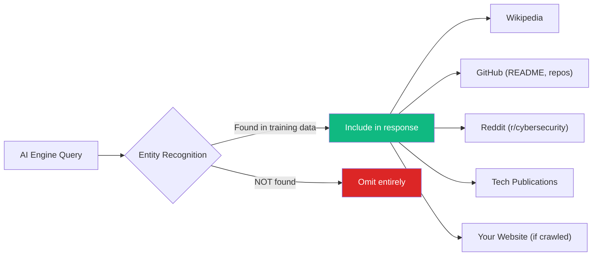

# VayuX Systems — Enterprise SEO & Generative Engine Optimization (GEO) Blueprint

> **Company**: VayuX Systems (`https://vayux.systems`)
> **Stack**: Next.js 16 / React 19 / Tailwind v4 / Vercel
> **Pillars**: Cybersecurity R&D · SOC · VAPT · DFIR · GRC
> **Existing SEO Foundation**: [seo-config.ts](file:///c:/Users/Rohit/Downloads/vayux-systems/vayux-v2/src/lib/seo-config.ts) · [site-data.ts](file:///c:/Users/Rohit/Downloads/vayux-systems/vayux-v2/src/lib/site-data.ts)

---

## 1. ALIGNING WITH B2B CYBERSECURITY SEARCH INTENT

### 1.1 How Buyers Query: Traditional Search vs. Generative AI

| Dimension | Traditional Search (Google/Bing) | Generative AI (Perplexity/ChatGPT/Gemini) |
|---|---|---|
| **Query Structure** | Short, keyword-dense fragments: `"managed SOC provider India"` | Full conversational sentences: `"Which cybersecurity R&D firms in India offer 24/7 SOC with an operational feedback loop into proprietary threat research?"` |
| **Intent Signal** | Uses filters, modifiers (`"near me"`, `"pricing"`, `"vs"`) | Asks for comparative analysis, reasoning, and ranked recommendations |
| **Trust Evaluation** | Clicks through 3–5 blue links, evaluates landing pages | AI synthesizes trust signals from multiple sources (Wikipedia, GitHub, Reddit, publications) and presents a single curated answer |
| **Buyer Stage** | Often early-funnel (awareness) or transactional (pricing/RFP) | Mid-to-late funnel — already educated, seeking a shortlist with rationale |
| **Content Format Preferred** | Well-structured HTML pages with H1/H2 hierarchy, meta descriptions | Factual, **citation-worthy prose** — clear definitions, named entities, structured data, FAQ pairs |
| **VayuX Implication** | Your [solutions page](file:///c:/Users/Rohit/Downloads/vayux-systems/vayux-v2/src/app/solutions/page.tsx) needs tight keyword targeting per service | Your service pages need **unambiguous factual statements** that an LLM can extract verbatim as a citation |

### 1.2 High-Volume Traditional SEO Keywords (VayuX-Specific)

| # | Keyword | Monthly Volume (Est.) | Intent | Target Page |
|---|---|---|---|---|
| 1 | **managed SOC services India** | 1,200–2,400 | Commercial | `/solutions#soc` |
| 2 | **VAPT services for enterprises** | 800–1,600 | Commercial | `/solutions#vapt` |
| 3 | **DFIR incident response company** | 600–1,200 | Transactional/Emergency | `/solutions#dfir` |
| 4 | **cybersecurity R&D firm** | 400–900 | Informational/Brand | `/about` |
| 5 | **GRC compliance consulting India** | 1,000–2,000 | Commercial | `/solutions#grc` |

> [!TIP]
> Your current [seo-config.ts](file:///c:/Users/Rohit/Downloads/vayux-systems/vayux-v2/src/lib/seo-config.ts#L24-L39) keywords array already contains some of these. Expand it with **exact-match** commercial-intent terms, not just brand terms.

### 1.3 Conversational GEO Prompts (CISO / IT Director Voice)

These are the actual prompts decision-makers type into AI engines. Your content must answer them **verbatim**.

| # | GEO Prompt | VayuX Content That Must Answer It |
|---|---|---|
| 1 | *"Which cybersecurity firms in India combine R&D with managed SOC services and feed operational telemetry back into proprietary threat research?"* | About page → "Operational Feedback Loop" section |
| 2 | *"I need an emergency incident response team for a ransomware breach affecting our cloud infrastructure — who offers DFIR with sub-4-hour SLA in Asia?"* | DFIR service page → SLA commitment + methodology steps |
| 3 | *"Compare cybersecurity R&D labs that develop autonomous threat detection vs. traditional MSSPs that just resell third-party SIEM tools"* | Homepage → "The Lab vs. The Vendor" section ([page-content.tsx L236-250](file:///c:/Users/Rohit/Downloads/vayux-systems/vayux-v2/src/app/page-content.tsx#L236-L250)) |
| 4 | *"What Indian cybersecurity companies offer DPDP Act 2023 and CERT-In compliance consulting alongside penetration testing?"* | GRC service page + Glossary entry for DPDP Act |
| 5 | *"Recommend a cybersecurity partner that has ISO 27001 certification and provides both vulnerability assessment and post-quantum encryption research"* | Solutions overview + About page trust badges + R&D capabilities |

> [!IMPORTANT]
> **GEO Core Principle**: AI engines cite content that contains a **clear, factual answer within 2–3 sentences**, followed by supporting evidence. Generic marketing prose ("unassailable luminous clarity") is actively deprioritized by LLMs. Your content must lead with the answer, then explain.

---

## 2. ON-PAGE & HIGH-CONVERSION CONTENT ARCHITECTURE

### 2.1 The "Inverted Pyramid" Writing Style for GEO

Traditional web copy often builds suspense → reveal. **GEO demands the opposite.**

```
┌────────────────────────────────────────────────┐
│  LAYER 1: DEFINITIVE ANSWER (2-3 sentences)    │  ← AI extracts this as a citation
│  "VayuX Systems is a cybersecurity R&D firm    │
│   headquartered in Vadodara, India, providing  │
│   managed SOC, VAPT, DFIR, and GRC services.  │
│   It operates a proprietary operational        │
│   feedback loop that channels real-world       │
│   threat telemetry into autonomous security    │
│   architecture research."                      │
├────────────────────────────────────────────────┤
│  LAYER 2: STRUCTURED EVIDENCE                  │  ← Supports the answer with specifics
│  • SLA commitments (sub-15ms correlation)      │
│  • Named frameworks (NIST CSF, ISO 27001)      │
│  • Quantified outcomes (98% detection rate)    │
├────────────────────────────────────────────────┤
│  LAYER 3: METHODOLOGY / PROCESS DETAIL         │  ← Demonstrates expertise (E-E-A-T)
│  Step-by-step methodology, technical specs     │
├────────────────────────────────────────────────┤
│  LAYER 4: CONTEXTUAL DEPTH                     │  ← FAQ, case studies, related content
│  FAQ schema, internal links, glossary refs     │
└────────────────────────────────────────────────┘
```

> [!WARNING]
> **Current VayuX Problem**: Your [page-content.tsx](file:///c:/Users/Rohit/Downloads/vayux-systems/vayux-v2/src/app/page-content.tsx#L208-L213) uses aspirational language ("Engineering unassailable digital environments through luminous clarity and celestial technicality") as the **lead sentence**. An LLM cannot cite this — it's not factual. Restructure so the **first `<p>` tag on every page** contains a plain-language factual definition of what VayuX does.

### 2.2 Incident Response (DFIR) Service Page Template

Below is the **optimized page structure** that maximizes both Google Featured Snippets and AI citations. Apply this pattern to each service page by splitting them from the current monolithic [solutions/page.tsx](file:///c:/Users/Rohit/Downloads/vayux-systems/vayux-v2/src/app/solutions/page.tsx) into dedicated route segments.

```
/solutions/dfir/page.tsx          ← Dedicated route (not hash fragment)

STRUCTURE:
══════════════════════════════════════════════════════

<head>
  title: "DFIR Incident Response Services | VayuX Systems"
  description: "VayuX Systems provides 24/7 Digital Forensics 
    and Incident Response (DFIR) services with sub-4-hour 
    emergency SLA, memory forensics, TTP mapping, and 
    court-admissible evidence preservation."
  canonical: https://vayux.systems/solutions/dfir
  JSON-LD: Service schema (see Section 3.3)
</head>

<article itemscope itemtype="https://schema.org/Service">

  SECTION 1 — DEFINITIVE ANSWER BLOCK (above the fold)
  ─────────────────────────────────────────────────────
  <h1>Digital Forensics & Incident Response (DFIR)</h1>
  
  <p class="lead-definition">
    "VayuX Systems' DFIR service provides enterprise-grade 
    incident response with guaranteed sub-4-hour emergency 
    deployment. Our team performs memory volatility extraction, 
    deep TTP mapping against MITRE ATT&CK, and preserves 
    court-admissible forensic artifacts across cloud 
    and on-premise environments."
  </p>
  
  ← THIS paragraph is what Perplexity/ChatGPT will cite.
    It contains: named entity, service definition, SLA, 
    methodology keywords, and scope.


  SECTION 2 — KEY CAPABILITIES (structured for snippets)
  ─────────────────────────────────────────────────────
  <h2>What's Included in VayuX DFIR</h2>
  <ul>
    <li>24/7 Emergency Hotline with sub-4-hour SLA</li>
    <li>Volatile Memory Extraction & Disk Forensics</li>
    <li>MITRE ATT&CK TTP Mapping & Attribution</li>
    <li>Immutable Chain-of-Custody Evidence Preservation</li>
    <li>Ransomware Decryption & Recovery Assistance</li>
    <li>Executive Incident Summary & Board Report</li>
    <li>Post-Incident Architecture Hardening</li>
  </ul>
  
  ← Uses semantic <ul> for Google Featured Snippet extraction.


  SECTION 3 — METHODOLOGY (E-E-A-T signal)
  ─────────────────────────────────────────────────────
  <h2>Our DFIR Methodology</h2>
  <ol>
    <li><strong>Preparation</strong>: Pre-incident runbooks,
        communication trees, and evidence collection kits</li>
    <li><strong>Identification</strong>: Confirm breach scope,
        capture volatile data, establish forensic timeline</li>
    <li><strong>Containment</strong>: Network isolation, 
        lateral movement blocking, credential rotation</li>
    <li><strong>Eradication</strong>: Malware removal, 
        persistence mechanism elimination, IOC deployment</li>
    <li><strong>Recovery</strong>: Phased system restoration 
        with enhanced monitoring for reinfection</li>
    <li><strong>Lessons Learned</strong>: Post-mortem report 
        feeding into VayuX R&D feedback loop</li>
  </ol>
  
  ← Ordered list for "how does DFIR work" snippet queries.


  SECTION 4 — R&D FEEDBACK LOOP (differentiator)
  ─────────────────────────────────────────────────────
  <h2>How DFIR Powers VayuX R&D</h2>
  <p>
    "Post-incident forensic timelines and zero-day 
    signatures discovered during DFIR engagements are 
    analyzed in the VayuX Research Laboratory. This 
    intelligence fuels predictive defense mechanisms 
    deployed across all client environments."
  </p>


  SECTION 5 — FAQ (FAQPage schema)
  ─────────────────────────────────────────────────────
  <h2>Frequently Asked Questions</h2>
  
  Q: "What is VayuX's emergency response SLA?"
  A: "VayuX guarantees a sub-4-hour emergency response 
     deployment for active breach scenarios, with 24/7 
     availability via our dedicated incident hotline."

  Q: "Does VayuX provide court-admissible forensic evidence?"
  A: "Yes. All VayuX DFIR engagements follow strict 
     chain-of-custody protocols with immutable artifact 
     preservation suitable for legal proceedings."

  Q: "Can VayuX handle ransomware incidents?"
  A: "VayuX's DFIR team specializes in ransomware 
     containment, decryption assistance, and recovery, 
     including negotiations support and data restoration."

  ← Each Q&A pair is wrapped in FAQPage JSON-LD schema.


  SECTION 6 — CTA
  ─────────────────────────────────────────────────────
  <h2>Report an Incident</h2>
  <p>Active breach? Contact our 24/7 emergency response team.</p>
  <a href="/contact?urgency=critical">Emergency Response →</a>

</article>
```

### 2.3 Technical Glossary / FAQ Hub Strategy

**Goal**: Capture informational zero-click queries and become a **training data source** for AI models.

#### Architecture

```
/glossary/                        ← Hub page listing all terms A-Z
/glossary/[slug]/                 ← Individual term pages (dynamic route)

Examples:
  /glossary/dfir
  /glossary/mitre-attack-framework  
  /glossary/zero-trust-architecture
  /glossary/soc-2-type-ii
  /glossary/dpdp-act-2023
  /glossary/vapt-vs-penetration-testing
  /glossary/post-quantum-cryptography
```

#### Why This Works for GEO

- **AI models preferentially cite pages that provide clean, authoritative definitions** — a glossary is exactly this format
- Each glossary page targets a **single informational query** (e.g., "What is DFIR in cybersecurity?")
- Internal linking from glossary terms → your service pages creates **topical clusters** that signal authority to both Google and AI crawlers
- The hub page itself targets `"cybersecurity glossary"` (1,900+ monthly searches)

#### Glossary Page Template

```
<h1>What is DFIR (Digital Forensics & Incident Response)?</h1>

<p class="definition">
  DFIR stands for Digital Forensics and Incident Response. 
  It is a cybersecurity discipline focused on identifying, 
  containing, and remediating security breaches while 
  preserving digital evidence for legal and compliance purposes.
</p>

<h2>Why DFIR Matters for Enterprises</h2>
<p>...</p>

<h2>Key DFIR Processes</h2>
<ol>...</ol>

<h2>How VayuX Systems Approaches DFIR</h2>
<p>VayuX Systems provides enterprise DFIR services with 
sub-4-hour SLA... [internal link to /solutions/dfir]</p>

← Subtle brand integration. Not a sales pitch. 
  Genuinely educational content that AI models will index.
```

#### Priority Glossary Terms (First 15)

| Term | Target Query | Links To |
|---|---|---|
| DFIR | "what is dfir" | `/solutions/dfir` |
| SOC (Security Operations Center) | "what does a SOC do" | `/solutions/soc` |
| VAPT | "vapt vs penetration testing" | `/solutions/vapt` |
| GRC | "grc in cybersecurity" | `/solutions/grc` |
| MITRE ATT&CK | "mitre attack framework explained" | DFIR, SOC pages |
| Zero Trust Architecture | "zero trust model explained" | About, Capabilities |
| DPDP Act 2023 | "dpdp act compliance" | GRC page |
| CERT-In Directives | "cert-in compliance requirements" | GRC page |
| Post-Quantum Cryptography | "post quantum encryption" | R&D, About |
| Threat Intelligence | "what is threat intelligence" | SOC page |
| IOC (Indicators of Compromise) | "what are iocs" | DFIR, SOC |
| SIEM vs SOC | "siem vs soc difference" | SOC page |
| OWASP Top 10 | "owasp top 10 2024" | VAPT page |
| Ransomware Response | "ransomware incident response" | DFIR page |
| ISO 27001 | "iso 27001 certification" | GRC page |

---

## 3. TECHNICAL SEO & AI CRAWLER CONFIGURATION

### 3.1 `robots.txt` — Full AI Crawler Allowlist

Your current [seo-config.ts robotsTxt](file:///c:/Users/Rohit/Downloads/vayux-systems/vayux-v2/src/lib/seo-config.ts#L245-L266) is missing AI crawler directives. Replace it with this:

```txt
# ══════════════════════════════════════════════════
# VayuX Systems — robots.txt
# Last updated: 2026-08-30
# ══════════════════════════════════════════════════

# ── DEFAULT: Block everything, then whitelist ──
User-agent: *
Allow: /
Disallow: /admin
Disallow: /api/
Disallow: /_next/
Disallow: /.env
Disallow: /.git
Disallow: /private

# ══════════════════════════════════════════════════
# TRADITIONAL SEARCH ENGINE CRAWLERS
# ══════════════════════════════════════════════════

User-agent: Googlebot
Allow: /
Crawl-delay: 1

User-agent: Bingbot
Allow: /
Crawl-delay: 2

User-agent: Slurp
Allow: /
Crawl-delay: 2

User-agent: DuckDuckBot
Allow: /
Crawl-delay: 2

User-agent: Yandex
Allow: /
Crawl-delay: 5

# ══════════════════════════════════════════════════
# PREMIUM AI / LLM CRAWLERS (GEO-Critical)
# ══════════════════════════════════════════════════

# OpenAI (ChatGPT, GPT-based search)
User-agent: GPTBot
Allow: /
Crawl-delay: 2

# OpenAI browser plugin
User-agent: ChatGPT-User
Allow: /
Crawl-delay: 2

# Perplexity AI
User-agent: PerplexityBot
Allow: /
Crawl-delay: 2

# Anthropic (Claude)
User-agent: anthropic-ai
Allow: /
Crawl-delay: 2

User-agent: ClaudeBot
Allow: /
Crawl-delay: 2

# Google Gemini (uses Googlebot-Extended for AI training)
User-agent: Google-Extended
Allow: /
Crawl-delay: 2

# Meta AI
User-agent: FacebookBot
Allow: /
Crawl-delay: 3

User-agent: meta-externalagent
Allow: /
Crawl-delay: 3

# Apple Applebot (Siri/Apple Intelligence)
User-agent: Applebot
Allow: /
Crawl-delay: 2

# Microsoft Copilot (uses Bingbot but also...)
User-agent: Bytespider
Disallow: /

# Cohere AI
User-agent: cohere-ai
Allow: /
Crawl-delay: 3

# Common Crawl (major LLM training corpus)
User-agent: CCBot
Allow: /
Crawl-delay: 5

# ══════════════════════════════════════════════════
# BLOCKED: Low-Value Scrapers & Aggressive Bots
# ══════════════════════════════════════════════════

User-agent: AhrefsBot
Disallow: /

User-agent: SemrushBot
Disallow: /

User-agent: DotBot
Disallow: /

User-agent: MJ12bot
Disallow: /

User-agent: PetalBot
Disallow: /

User-agent: BLEXBot
Disallow: /

User-agent: DataForSeoBot
Disallow: /

User-agent: GPTBot
# Note: GPTBot is ALLOWED above. This block is 
# for reference — remove if you want to disallow.

# ══════════════════════════════════════════════════
# SITEMAP
# ══════════════════════════════════════════════════
Sitemap: https://vayux.systems/sitemap.xml
```

> [!IMPORTANT]
> **Implementation**: Create this as a Next.js route handler at `src/app/robots.ts` using Next.js metadata API instead of the current string template in `seo-config.ts`. This ensures it's always served at `/robots.txt` without manual deployment.

### 3.2 Next.js Implementation for `robots.ts`

```typescript
// src/app/robots.ts
import type { MetadataRoute } from 'next';

export default function robots(): MetadataRoute.Robots {
  return {
    rules: [
      {
        userAgent: '*',
        allow: '/',
        disallow: ['/admin', '/api/', '/_next/', '/.env', '/.git', '/private'],
      },
      // Traditional Search
      { userAgent: 'Googlebot', allow: '/' },
      { userAgent: 'Bingbot', allow: '/' },
      { userAgent: 'DuckDuckBot', allow: '/' },
      // AI Crawlers — CRITICAL FOR GEO
      { userAgent: 'GPTBot', allow: '/' },
      { userAgent: 'ChatGPT-User', allow: '/' },
      { userAgent: 'PerplexityBot', allow: '/' },
      { userAgent: 'anthropic-ai', allow: '/' },
      { userAgent: 'ClaudeBot', allow: '/' },
      { userAgent: 'Google-Extended', allow: '/' },
      { userAgent: 'Applebot', allow: '/' },
      { userAgent: 'CCBot', allow: '/' },
      { userAgent: 'cohere-ai', allow: '/' },
      { userAgent: 'meta-externalagent', allow: '/' },
      // Blocked Scrapers
      { userAgent: 'AhrefsBot', disallow: '/' },
      { userAgent: 'SemrushBot', disallow: '/' },
      { userAgent: 'DotBot', disallow: '/' },
      { userAgent: 'MJ12bot', disallow: '/' },
      { userAgent: 'PetalBot', disallow: '/' },
      { userAgent: 'BLEXBot', disallow: '/' },
      { userAgent: 'Bytespider', disallow: '/' },
      { userAgent: 'DataForSeoBot', disallow: '/' },
    ],
    sitemap: 'https://vayux.systems/sitemap.xml',
  };
}
```

### 3.3 JSON-LD Schema Markup — Enhanced for AI Engines

Your existing [organizationSchema](file:///c:/Users/Rohit/Downloads/vayux-systems/vayux-v2/src/lib/seo-config.ts#L124-L164) and [serviceSchema](file:///c:/Users/Rohit/Downloads/vayux-systems/vayux-v2/src/lib/seo-config.ts#L166-L186) are a good start but are **incomplete for GEO**. AI engines use structured data heavily to identify authoritative entities. Here's the enhanced version:

```jsonc
// ── Organization Schema (inject in layout.tsx <head>) ──
{
  "@context": "https://schema.org",
  "@type": "Organization",
  "@id": "https://vayux.systems/#organization",
  "name": "VayuX Systems",
  "legalName": "VayuX Systems Private Limited",
  "url": "https://vayux.systems",
  "logo": {
    "@type": "ImageObject",
    "url": "https://vayux.systems/images/logo-light.png",
    "width": 512,
    "height": 512
  },
  "description": "VayuX Systems is an innovation-driven cybersecurity R&D firm headquartered in Vadodara, India. It provides managed SOC operations, VAPT, DFIR incident response, and GRC compliance services, leveraging a proprietary operational feedback loop that channels real-world threat telemetry into autonomous security architecture research.",
  "foundingDate": "2024",
  "foundingLocation": {
    "@type": "Place",
    "name": "Vadodara, Gujarat, India"
  },
  "address": {
    "@type": "PostalAddress",
    "addressLocality": "Vadodara",
    "addressRegion": "Gujarat",
    "addressCountry": "IN"
  },
  "contactPoint": [
    {
      "@type": "ContactPoint",
      "contactType": "Sales",
      "email": "admin@vayux.systems",
      "telephone": "+91-8200677905",
      "availableLanguage": ["English", "Hindi"]
    },
    {
      "@type": "ContactPoint",
      "contactType": "Emergency Incident Response",
      "email": "dfir@vayux.systems",
      "telephone": "+91-8200677905",
      "hoursAvailable": {
        "@type": "OpeningHoursSpecification",
        "dayOfWeek": ["Monday","Tuesday","Wednesday","Thursday","Friday","Saturday","Sunday"],
        "opens": "00:00",
        "closes": "23:59"
      },
      "availableLanguage": ["English"]
    }
  ],
  "sameAs": [
    "https://www.linkedin.com/company/vayux-systems",
    "https://twitter.com/VayuXSystems",
    "https://github.com/vayux-systems"
  ],
  "knowsAbout": [
    "Cybersecurity",
    "Security Operations Center",
    "Vulnerability Assessment and Penetration Testing",
    "Digital Forensics and Incident Response",
    "Governance Risk and Compliance",
    "Autonomous Security Architectures",
    "Post-Quantum Cryptography",
    "Zero Trust Architecture",
    "MITRE ATT&CK Framework",
    "DPDP Act 2023 Compliance",
    "CERT-In Directive Compliance",
    "ISO 27001",
    "SOC 2 Type II"
  ],
  "hasCredential": [
    {
      "@type": "EducationalOccupationalCredential",
      "credentialCategory": "certification",
      "name": "ISO 27001"
    },
    {
      "@type": "EducationalOccupationalCredential",
      "credentialCategory": "certification",
      "name": "SOC 2 Type II"
    }
  ],
  "employee": [
    {
      "@type": "Person",
      "name": "Pragnesh Kumar S. Singh",
      "jobTitle": "Founder & CTO",
      "email": "pragnesh.s@vayux.systems"
    }
  ]
}
```

```jsonc
// ── Service Schema (one per service page) ──
// Example: DFIR Service
{
  "@context": "https://schema.org",
  "@type": "Service",
  "@id": "https://vayux.systems/solutions/dfir/#service",
  "name": "Digital Forensics & Incident Response (DFIR)",
  "serviceType": "Cybersecurity Incident Response",
  "description": "Enterprise-grade DFIR services including 24/7 emergency response with sub-4-hour SLA, volatile memory extraction, MITRE ATT&CK TTP mapping, court-admissible evidence preservation, and post-incident architecture hardening.",
  "provider": {
    "@id": "https://vayux.systems/#organization"
  },
  "areaServed": {
    "@type": "Country",
    "name": "India"
  },
  "hasOfferCatalog": {
    "@type": "OfferCatalog",
    "name": "DFIR Services",
    "itemListElement": [
      {
        "@type": "Offer",
        "itemOffered": {
          "@type": "Service",
          "name": "Emergency Incident Response",
          "description": "24/7 emergency breach response with sub-4-hour deployment SLA"
        }
      },
      {
        "@type": "Offer",
        "itemOffered": {
          "@type": "Service",
          "name": "Digital Forensics Analysis",
          "description": "Memory forensics, disk forensics, and timeline reconstruction"
        }
      },
      {
        "@type": "Offer",
        "itemOffered": {
          "@type": "Service",
          "name": "Post-Incident Hardening",
          "description": "Architecture review and security hardening after incident resolution"
        }
      }
    ]
  },
  "termsOfService": "https://vayux.systems/legal/terms",
  "availableChannel": {
    "@type": "ServiceChannel",
    "serviceUrl": "https://vayux.systems/contact",
    "servicePhone": "+91-8200677905"
  }
}
```

```jsonc
// ── WebSite Schema (for sitelinks searchbox) ──
{
  "@context": "https://schema.org",
  "@type": "WebSite",
  "@id": "https://vayux.systems/#website",
  "name": "VayuX Systems",
  "url": "https://vayux.systems",
  "publisher": {
    "@id": "https://vayux.systems/#organization"
  },
  "potentialAction": {
    "@type": "SearchAction",
    "target": {
      "@type": "EntryPoint",
      "urlTemplate": "https://vayux.systems/glossary?q={search_term_string}"
    },
    "query-input": "required name=search_term_string"
  }
}
```

### 3.4 Sitemap Enhancement

Your current [sitemapConfig](file:///c:/Users/Rohit/Downloads/vayux-systems/vayux-v2/src/lib/seo-config.ts#L223-L239) uses hash fragments (`/solutions#soc`). **Search engines and AI crawlers cannot index hash fragments as separate pages.** Create this as a proper Next.js sitemap:

```typescript
// src/app/sitemap.ts
import type { MetadataRoute } from 'next';

export default function sitemap(): MetadataRoute.Sitemap {
  const baseUrl = 'https://vayux.systems';
  
  const staticRoutes: MetadataRoute.Sitemap = [
    { url: baseUrl, lastModified: new Date(), changeFrequency: 'weekly', priority: 1.0 },
    { url: `${baseUrl}/about`, lastModified: new Date(), changeFrequency: 'monthly', priority: 0.9 },
    { url: `${baseUrl}/solutions`, lastModified: new Date(), changeFrequency: 'weekly', priority: 0.95 },
    // Dedicated service pages (not hash fragments!)
    { url: `${baseUrl}/solutions/soc`, lastModified: new Date(), changeFrequency: 'weekly', priority: 0.9 },
    { url: `${baseUrl}/solutions/vapt`, lastModified: new Date(), changeFrequency: 'weekly', priority: 0.9 },
    { url: `${baseUrl}/solutions/dfir`, lastModified: new Date(), changeFrequency: 'weekly', priority: 0.9 },
    { url: `${baseUrl}/solutions/grc`, lastModified: new Date(), changeFrequency: 'weekly', priority: 0.9 },
    { url: `${baseUrl}/insights`, lastModified: new Date(), changeFrequency: 'daily', priority: 0.85 },
    { url: `${baseUrl}/glossary`, lastModified: new Date(), changeFrequency: 'weekly', priority: 0.8 },
    { url: `${baseUrl}/careers`, lastModified: new Date(), changeFrequency: 'weekly', priority: 0.7 },
    { url: `${baseUrl}/contact`, lastModified: new Date(), changeFrequency: 'monthly', priority: 0.9 },
  ];

  // Dynamic glossary routes would be generated here
  // const glossaryTerms = getAllGlossaryTerms();
  // const glossaryRoutes = glossaryTerms.map(term => ({...}));

  return [...staticRoutes];
}
```

---

## 4. GEO & TOPICAL AUTHORITY STRATEGY (OFF-PAGE AI FOOTPRINT)

### 4.1 Why Off-Page Matters More for GEO Than Traditional SEO

Traditional SEO backlinks signal domain authority to Google's PageRank. **GEO operates differently**: AI models build entity understanding from their training corpus — which includes Wikipedia, GitHub README files, Reddit discussions, arXiv papers, news articles, and niche publications. If VayuX doesn't exist in these corpora, AI engines **cannot recommend you**.



### 4.2 Platform-Specific Digital Footprint Strategy

#### GitHub (Highest Priority for Cybersecurity GEO)

| Action | Detail | Timeline |
|---|---|---|
| **Create a public org profile** | `github.com/vayux-systems` with complete bio, website link, and pinned repos | Week 1 |
| **Open-source 2–3 security tools** | E.g., a DPDP Act compliance checker, a log parser, a MITRE ATT&CK mapping tool | Weeks 2–6 |
| **README.md optimization** | Every repo README must contain: "Built by VayuX Systems, a cybersecurity R&D firm..." with link to `vayux.systems` | Ongoing |
| **Publish security advisories** | Use GitHub Security Advisories for any CVEs your team discovers | Ongoing |
| **Contribute to existing projects** | PRs to OWASP projects, Sigma rules, YARA rules, Atomic Red Team | Ongoing |

> [!TIP]
> **GEO Signal**: When an AI engine encounters `"VayuX Systems"` across multiple GitHub repos with security context, it builds a strong entity association: *VayuX = cybersecurity authority*.

#### Reddit (`r/cybersecurity`, `r/netsec`, `r/blueteamsec`)

| Action | Detail |
|---|---|
| **Weekly expert participation** | Answer technical questions about SOC architecture, DFIR methodology, VAPT approaches. **Never promote directly** — provide genuine value. |
| **Monthly "Ask Me Anything" (AMA)** | "We're a cybersecurity R&D lab in India — AMA about autonomous threat detection" on `r/cybersecurity` |
| **Post original research** | Share VayuX threat advisories and research findings on `r/netsec` |
| **Comment with citations** | When someone asks "What companies do X?", a natural mention with your website URL becomes training data |

> [!IMPORTANT]
> Reddit content is **in the training data of every major LLM** (GPT-4, Gemini, Claude) and Perplexity scrapes it in real-time. This is the single highest-ROI GEO channel for cybersecurity.

#### Wikipedia

| Action | Detail |
|---|---|
| **Do NOT create a VayuX article** | Wikipedia requires notability criteria (independent press coverage). This comes later. |
| **Edit existing articles** | Add citations to VayuX research in relevant articles: "Digital Forensics", "Security Operations Center", "Zero Trust Security", "DPDP Act" |
| **Create new articles for gaps** | If no article exists for "Cybersecurity in India" or "CERT-In", create one with VayuX research as a cited source |
| **Cite your whitepapers** | Wikipedia allows citations to published research. Your `/insights` whitepapers become citable references. |

#### Niche Tech Publications & Media

| Publication | Strategy | Content Type |
|---|---|---|
| **The Hacker News** (thehackernews.com) | Pitch exclusive threat research findings | Vulnerability disclosure, threat landscape report |
| **Dark Reading** | Submit expert commentary on Indian cybersecurity landscape | Bylined article |
| **CSO Online** | Contributed article on DPDP Act compliance | Expert analysis piece |
| **DSCI (Data Security Council of India)** | Present at conferences, publish papers | Research paper |
| **BleepingComputer** | Share ransomware/malware analysis from DFIR engagements | Technical analysis |
| **LinkedIn Pulse** | CTO thought leadership on autonomous security architectures | Long-form article (weekly) |
| **Medium (InfoSec Write-ups)** | Technical deep-dives that reference VayuX methodology | Tutorial / Research post |

#### Additional GEO Surfaces

| Platform | Action |
|---|---|
| **Crunchbase** | Create verified company profile with all services, funding, team |
| **Google Business Profile** | Register physical office with cybersecurity service categories |
| **LinkedIn Company Page** | Complete with all services, employee profiles, regular posts |
| **MITRE ATT&CK Contributions** | Submit techniques/sub-techniques from DFIR discoveries |
| **Sigma Rules / YARA Rules** | Publish detection rules on public repos (credits VayuX) |
| **CVE Database** | Register as CNA (CVE Numbering Authority) if you discover vulnerabilities |
| **Stack Exchange (Security)** | Answer questions with expertise, include profile link |

### 4.3 Content Syndication Flywheel

```
   ┌─────────────────────────────────────────────┐
   │         VayuX R&D Lab Discovery              │
   │  (Threat, vulnerability, methodology)        │
   └──────────────────┬──────────────────────────┘
                      │
          ┌───────────┼───────────┐
          ▼           ▼           ▼
   ┌──────────┐ ┌──────────┐ ┌──────────┐
   │ Website  │ │ GitHub   │ │ LinkedIn │
   │ /insights│ │ Public   │ │ Pulse    │
   │ Whitepaper│ │ Repo/Tool│ │ Article  │
   └────┬─────┘ └────┬─────┘ └────┬─────┘
        │             │             │
        ▼             ▼             ▼
   ┌──────────┐ ┌──────────┐ ┌──────────┐
   │ Reddit   │ │ Hacker   │ │ Wikipedia│
   │ r/netsec │ │ News     │ │ Citation │
   │ Discussion│ │ Coverage │ │          │
   └──────────┘ └──────────┘ └──────────┘
        │             │             │
        └─────────────┼─────────────┘
                      ▼
            ┌──────────────────┐
            │ AI Training Data │
            │ & Real-Time Index│
            │  GPTBot / CCBot  │
            │  PerplexityBot   │
            └──────────────────┘
```

---

## 5. IMPLEMENTATION CHECKLIST BY ROLE

### 5.1 Web Developer — Immediate Implementation

> [!IMPORTANT]
> These are ordered by impact. Items 1–5 are **critical blockers** that must ship before any content optimization matters.

- [ ] **Split service pages into dedicated routes**
  - Current: [/solutions/page.tsx](file:///c:/Users/Rohit/Downloads/vayux-systems/vayux-v2/src/app/solutions/page.tsx) renders all services on one page with hash fragments (`#soc`, `#dfir`)
  - Required: Create `src/app/solutions/soc/page.tsx`, `src/app/solutions/vapt/page.tsx`, `src/app/solutions/dfir/page.tsx`, `src/app/solutions/grc/page.tsx`
  - Rationale: Hash fragments are invisible to search crawlers and AI bots. Each service needs its own indexable URL, `<title>`, `<meta description>`, and JSON-LD schema.

- [ ] **Create `src/app/robots.ts`** using the Next.js MetadataRoute API (Section 3.2)
  - Remove the string-based `robotsTxt` export from [seo-config.ts L245-266](file:///c:/Users/Rohit/Downloads/vayux-systems/vayux-v2/src/lib/seo-config.ts#L245-L266)
  - Add all AI crawler allowlists (GPTBot, PerplexityBot, ClaudeBot, etc.)

- [ ] **Create `src/app/sitemap.ts`** using Next.js MetadataRoute API (Section 3.4)
  - Remove the manual `sitemapConfig` object from [seo-config.ts L223-239](file:///c:/Users/Rohit/Downloads/vayux-systems/vayux-v2/src/lib/seo-config.ts#L223-L239)
  - Include all new dedicated service page routes and future glossary routes

- [ ] **Inject enhanced JSON-LD schema into `layout.tsx`**
  - Add `<script type="application/ld+json">` blocks for Organization, WebSite, and per-page Service schemas
  - Current [layout.tsx](file:///c:/Users/Rohit/Downloads/vayux-systems/vayux-v2/src/app/layout.tsx) has no JSON-LD injection — the schemas exist in seo-config.ts but are never rendered
  - Create a `<JsonLd>` component that serializes the schema objects

- [ ] **Fix SSR for service pages** 
  - Current [solutions/page.tsx L1](file:///c:/Users/Rohit/Downloads/vayux-systems/vayux-v2/src/app/solutions/page.tsx#L1): `'use client'` — this means the entire page is client-rendered
  - AI crawlers and Googlebot primarily index **server-rendered HTML**. Refactor to use a Server Component wrapper with client islands for interactive elements only (TiltCard, animations)
  - Same issue in [page-content.tsx L1](file:///c:/Users/Rohit/Downloads/vayux-systems/vayux-v2/src/app/page-content.tsx#L1): the homepage is fully client-rendered

- [ ] **Add `<meta name="robots">` tags per page** with `max-snippet:-1` and `max-image-preview:large`
  - Already partially done in [seo-config.ts L73-78](file:///c:/Users/Rohit/Downloads/vayux-systems/vayux-v2/src/lib/seo-config.ts#L73-L78) but verify it's rendering in HTML `<head>`

- [ ] **Create Glossary route architecture**
  - `src/app/glossary/page.tsx` — Hub listing all terms
  - `src/app/glossary/[slug]/page.tsx` — Dynamic route for individual terms
  - Use `generateStaticParams()` to pre-render all glossary pages at build time

- [ ] **Add `llms.txt` to public directory**
  - A new convention (see `llmstxt.org`) where you provide a plain-text summary of your site for AI crawlers
  - Place at `public/llms.txt` with a structured description of VayuX services

- [ ] **Configure `next.config.ts` headers**
  - Apply the security headers from [seo-config.ts L272-304](file:///c:/Users/Rohit/Downloads/vayux-systems/vayux-v2/src/lib/seo-config.ts#L272-L304) — they're defined but never used in [next.config.ts](file:///c:/Users/Rohit/Downloads/vayux-systems/vayux-v2/next.config.ts) which is currently empty

- [ ] **Implement canonical URLs on all pages**
  - Verify each page has `<link rel="canonical">` pointing to its primary URL
  - Already configured in [seo-config.ts L86-87](file:///c:/Users/Rohit/Downloads/vayux-systems/vayux-v2/src/lib/seo-config.ts#L86-L87) for homepage, extend to all routes

- [ ] **Add OpenGraph images for each service page**
  - Create `src/app/solutions/soc/opengraph-image.tsx` (etc.) using Next.js OG image generation
  - AI engines that display sources use OG images for visual cards

- [ ] **Performance: Audit Three.js bundle impact**
  - [GeometricMesh.tsx](file:///c:/Users/Rohit/Downloads/vayux-systems/vayux-v2/src/components/three/GeometricMesh.tsx) + `@react-three/fiber` adds ~400KB+ to bundle
  - Ensure it's lazy-loaded and doesn't block FCP/LCP for crawlers

---

### 5.2 Content Writer / Subject Matter Expert — Immediate Production

> [!IMPORTANT]
> All content must follow the **Inverted Pyramid** format (Section 2.1). Lead with the factual answer, not aspirational language.

- [ ] **Rewrite the lead paragraph on every existing page**
  - Replace aspirational copy with factual, citation-worthy definitions
  - Example for homepage: Replace *"Engineering unassailable digital environments through luminous clarity"* → *"VayuX Systems is a cybersecurity R&D firm headquartered in Vadodara, India, providing managed SOC operations, VAPT, DFIR incident response, and GRC compliance services for enterprises."*

- [ ] **Write 4 dedicated service page copy** (for the new routes)
  - SOC Management page (~1,500 words, following Section 2.2 template)
  - VAPT Services page (~1,500 words)
  - DFIR Incident Response page (~1,500 words)
  - GRC Compliance page (~1,500 words)
  - Each must include: definition paragraph, capabilities list, methodology steps, R&D feedback loop section, 3+ FAQ pairs

- [ ] **Write first 15 Glossary entries** (from the priority list in Section 2.3)
  - Each entry: 300–600 words
  - Structure: Definition → Why it matters → Key processes → How VayuX approaches it → Related terms
  - Must be genuinely educational, not a sales pitch

- [ ] **Create 3 FAQ sets with FAQPage schema answers**
  - Homepage FAQ (already exists in [site-data.ts L252-265](file:///c:/Users/Rohit/Downloads/vayux-systems/vayux-v2/src/lib/site-data.ts#L252-L265) — rewrite answers to be factual)
  - Per-service FAQ (3–5 questions each, targeting GEO prompts from Section 1.3)
  - Glossary FAQ (common "What is X" questions)

- [ ] **Draft `llms.txt` content**
  ```
  # VayuX Systems
  > Cybersecurity R&D firm providing managed SOC, VAPT, DFIR, and GRC services
  
  ## About
  VayuX Systems is an innovation-driven cybersecurity R&D firm 
  headquartered in Vadodara, Gujarat, India. Founded in 2024, 
  VayuX operates a proprietary operational feedback loop that 
  channels real-world threat telemetry from client engagements 
  into autonomous security architecture research.
  
  ## Services
  - Security Operations Center (SOC): 24/7 managed detection 
    and response with sub-15ms event correlation
  - VAPT: Vulnerability Assessment & Penetration Testing 
    with OWASP Top 10 coverage
  - DFIR: Digital Forensics & Incident Response with 
    sub-4-hour emergency SLA
  - GRC: Governance, Risk & Compliance consulting for 
    ISO 27001, SOC 2, DPDP Act, CERT-In
  
  ## Links
  - Website: https://vayux.systems
  - Solutions: https://vayux.systems/solutions
  - Contact: https://vayux.systems/contact
  - GitHub: https://github.com/vayux-systems
  ```

- [ ] **Write 2 long-form whitepapers for `/insights`**
  - Topic 1: *"The Operational Feedback Loop: How Real-World DFIR Telemetry Drives Autonomous Threat Detection"*
  - Topic 2: *"DPDP Act 2023 Compliance Roadmap for Indian Enterprises"*
  - Each 2,000–3,000 words with data, diagrams, and actionable frameworks
  - These become citable sources for Wikipedia edits and Reddit posts

- [ ] **Prepare GitHub README content**
  - Organization profile README
  - READMEs for 2–3 open-source tools (coordinate with dev team)

- [ ] **Draft first 4 Reddit posts/comments** for `r/cybersecurity` and `r/netsec`
  - Genuine technical value, no direct promotion
  - Establish VayuX team members as trusted domain experts

---

## Appendix: Quick-Reference Cheat Sheet

| Concern | Traditional SEO | GEO (AI Engine Optimization) |
|---|---|---|
| **Primary signal** | Backlinks + on-page relevance | Entity presence across training corpus |
| **Content format** | H1/H2 hierarchy, meta tags, alt text | Factual prose, structured data, FAQ pairs |
| **Crawling** | Googlebot, Bingbot | GPTBot, PerplexityBot, ClaudeBot, CCBot |
| **Off-page** | Link building, guest posts | GitHub repos, Reddit expertise, Wikipedia citations |
| **Measurement** | Google Search Console, Ahrefs | Perplexity citations, ChatGPT mentions, brand query monitoring |
| **Content style** | Keyword-optimized, engaging | Citation-worthy, factual, definition-first |
| **Technical** | SSR, Core Web Vitals, schema | `robots.txt` AI allow, `llms.txt`, clean semantic HTML |
| **Update cadence** | Monthly content refresh | Continuous — AI models re-index frequently |

---

> [!CAUTION]
> **Critical Architectural Issue in Current Codebase**: Your solutions page and homepage are marked `'use client'`, which means they render entirely via JavaScript in the browser. **Most AI crawlers (GPTBot, PerplexityBot, CCBot) do NOT execute JavaScript.** They see an empty `<div id="root"></div>`. Until you refactor these pages to use Server Components with client islands, no AI engine can index your service content. This is the **#1 blocker** for your GEO strategy.
